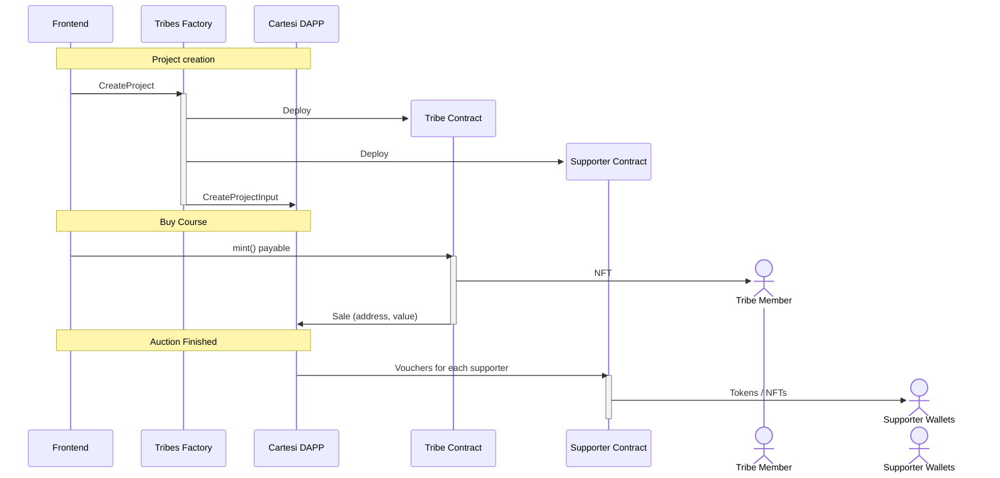

# Interactions

This lists the basic interaction among the different components of the system.

Components:

- **Frontend** - JavaScript frontend
- **Cartesi Dapp** - Python DApp on the Cartesi runtime
- **TribesFactory** - Layer 1 contract factory for creating the Supporter and Tribe Contract
- **Tribe Contract** - Layer 1 contract for managing the sales of a single course and NFT minting
- **Supporter Contract** - Layer 1 contract for managing the token minting for the supporters and affiliates/KOLs
- **Tribe Member** - Wallet of the Tribe member (who bought access to the project)
- **Supporter Wallets** - Wallet of the Supporter of a project

